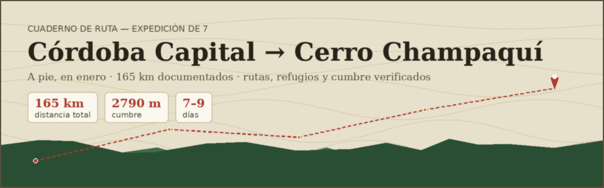

<div align="center">

</div>

<div align="center">

[]()
[](https://leafletjs.com/)
[]()
[]()

</div>

Cuaderno de ruta interactivo para una expedición de 7 personas caminando desde
Plaza Jerónimo del Barco (Córdoba Capital) hasta la cumbre del Cerro Champaquí,
en enero.

---

## Cómo abrirlo

No hace falta instalar nada ni levantar un servidor: abrí `index.html` con
cualquier navegador (doble clic, o arrastrarlo a una pestaña).

```bash
open index.html          # macOS
xdg-open index.html      # Linux
start index.html         # Windows
```

## Descargar para usar sin wifi

Desde el mapa, el botón **⬇ Sin wifi** abre un panel con los archivos para
llevar en el celular o el GPS antes de perder cobertura:

| Archivo | Para qué |
|---|---|
| `data/ruta_champaqui.gpx` | GPS de mano, Garmin, OsmAnd |
| `data/ruta_champaqui.kml` | Google Earth / Google Maps |
| `data/ruta_champaqui.geojson` | Datos crudos |
| `docs/GUIA_EXPEDICION_CHAMPAQUI.docx` | Guía completa, para leer offline |

## Qué funciona sin conexión y qué no

Este proyecto está armado para depender lo menos posible de internet:

- **Leaflet** (la librería del mapa) está vendorizado en `/vendor/leaflet` —
  no se descarga de ningún CDN.
- **Todos los puntos y las líneas de ruta** están en `/data/data.js`, ya
  calculados — no hay ninguna llamada en vivo a un motor de ruteo cuando
  abrís el mapa.
- **Tipografía**: fuentes de sistema (Georgia / la fuente del sistema
  operativo), no Google Fonts.

Lo único que sigue necesitando internet, y no hay forma de evitarlo sin un
paquete de tiles offline aparte, son **las imágenes del mapa base** (los
"tiles" de OpenStreetMap) — eso es así en cualquier mapa web interactivo,
incluido Google Maps. Si el mapa base no carga, todo lo demás (marcadores,
rutas, popups, capas, descargas) sigue funcionando igual — por eso conviene
bajar el GPX/KML antes de salir de cobertura.

## Cómo elegir ruta

El panel **Capas de ruta** agrupa las opciones documentadas en tres bloques:

| Grupo | Capa | Qué es |
|---|---|---|
| A pie — Córdoba → Villa Alpina | 🚶 Tramo A curado (rojo) | Camino más directo, pero vehicular: sin sendero peatonal verificado |
| A pie — Córdoba → Villa Alpina | 🥾 Camino viejo RP5 (oliva) | Más lento, pero evita la autovía nueva de peaje — mejor candidato para caminar |
| En auto (opcional) | 🚗 Traslado en auto (azul) | La opción más rápida y segura: resolver este tramo en vehículo |
| Sendero de montaña | ⛰ Sendero Champaquí (verde) | Villa Alpina → refugios → cumbre. El único tramo 100% verificado como sendero peatonal real |

## Cómo están hechas las rutas

Las líneas del mapa **conectan puntos reales y verificados entre sí** —
no son un trazado calculado por un motor de ruteo sobre la red de caminos.
Se decidió así a propósito: un motor de ruteo en vivo (tipo OSRM) necesita
internet cada vez que se abre el mapa, lo cual iba en contra de que este
proyecto funcione offline. La contrapartida es que la geometría exacta entre
dos puntos (si dobla en tal esquina, etc.) no está garantizada — lo que sí
está verificado es la ubicación de cada punto y la distancia/tiempo
documentados en cada tramo (ver `docs/GUIA_EXPEDICION_CHAMPAQUI.docx`).

Si en algún momento se quiere volver a un trazado ruteado en vivo (más
exacto, pero dependiente de conexión), la forma más simple es agregar una
llamada a un servicio OSRM público (por ejemplo
`https://routing.openstreetmap.de/routed-foot/route/v1/foot/`) en `app.js`
antes de dibujar cada `ROUTES[key].segments`.

## Estructura del proyecto

```
.
├── index.html                          # página principal
├── css/
│   └── style.css                       # estilos (paleta, tipografía, paneles)
├── js/
│   └── app.js                          # lógica del mapa (Leaflet, capas, popups)
├── data/
│   ├── data.js                         # puntos y rutas usados por el mapa
│   ├── ruta_champaqui.gpx              # waypoints para GPS/Garmin/OsmAnd
│   ├── ruta_champaqui.kml              # waypoints para Google Earth/Maps
│   └── ruta_champaqui.geojson          # waypoints en formato GeoJSON
├── docs/
│   ├── GUIA_EXPEDICION_CHAMPAQUI.docx  # guía de expedición completa (21 secciones)
│   └── banner/                         # banner del README (generado por script)
└── vendor/
    └── leaflet/                       # Leaflet vendorizado (sin CDN)
```

## Fuentes y verificación

Cada punto y cada ruta tiene su fuente citada en el popup (tocar el marcador
o la línea). Las etiquetas `[VERIFICADO]`, `[ESTIMADO]` y `[REQUIERE
CONFIRMACIÓN]` de la guía completa (`docs/GUIA_EXPEDICION_CHAMPAQUI.docx`)
indican qué tan sólido es cada dato. Antes de salir a caminar, revisar
especialmente la sección 3 de la guía (seguridad del Tramo A) y la sección 21
(checklist final).

## Publicarlo (GitHub Pages, opcional)

Una vez subido a un repositorio de GitHub, se puede activar GitHub Pages para
tener una versión online sin instalar nada:

1. Settings → Pages → Source: rama `main`, carpeta `/ (root)`.
2. Guardar. El sitio queda publicado en `https://<usuario>.github.io/<repo>/`.

No hace falta ningún paso de build — es HTML/CSS/JS plano.

---

<div align="center">

*Hecho para caminar 165 km sin depender del wifi.*

</div>
